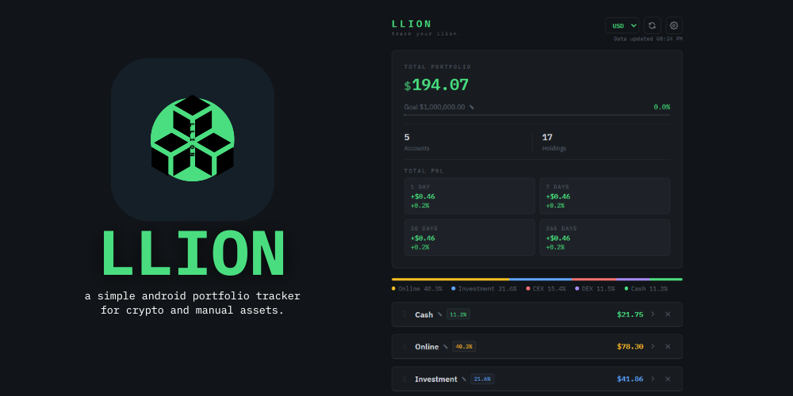
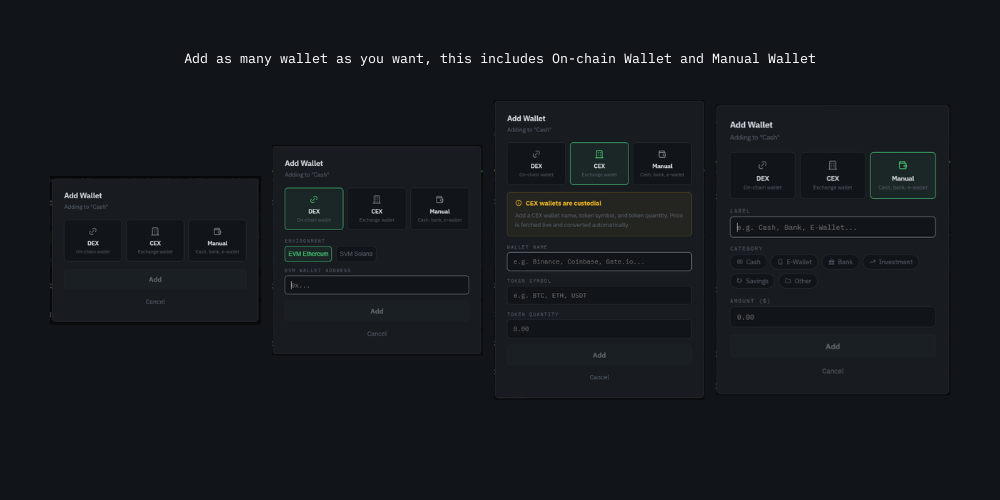

# Llion - track your llion.

A simple Android portfolio tracker for crypto and manual assets.

Track your wallets, manual balances, and total portfolio in one clean view.

## Download Android App

- Get the latest build from Releases:
  https://github.com/Zese07/llion/releases/

## What You Can Do

- View your total portfolio in one screen
- Add manual balances with categories (cash, bank, e-wallet, investment, savings, other)
- Import DEX wallets (EVM and SVM)
- Import tokens by contract address or mint
- Track CEX balances by wallet and token amount
- Switch display currency between USD and PHP
- Set a portfolio goal and track progress
- View PnL for 1D, 7D, 31D, and 365D
- Tap PnL cards to open detail views (1 day, 7 days, 4 weeks, 12 months)
- Export/import backups in-app
- Auto refresh when online, still usable offline with saved data

## Privacy And Safety

- No signup, no email/phone, and no API key needed
- Never asks for seed phrase or private key
- Data is stored locally on your device
- Backups are local files you export/import yourself
- Only public market and blockchain data is fetched

## Goal

Is for Llion to keep portfolio tracking clean, fast, and easy to check anytime.

## Credits

Made by Zese07.